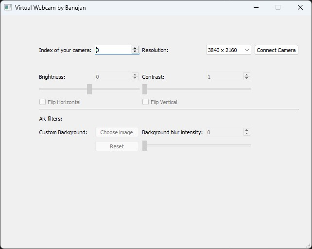

# Virtual Webcam
Application that allows users to modify the output of their webcam for a video call.

## How it works
2 components are needed for this application:
1. A real webcam connected to USB to the computer
2. A virtual camera client. This is a piece of software that needs to be installed on your PC. I recommand OBS Virtual CAM which comes installed with the OBS studio application. Download the latest version from : https://obsproject.com/download

In short, the application will connect to your real webcam, start the video recorder, process the frames based on the filters you have specified and display it on the virtual camera client. You will then be able to use the virtual camera on any websites or application that supports it. 

## Getting started
Below is the main screen of the application.
 

When you initially open the application, you will have the option of indicating the index and the resolution of your real webcam. As of now, the application is cannot display the name of the camera for each index (maybe in a future update?), so you will have to try one by one if you don't know. Please make sure to select the index of your real webcam and not the index of the virtual camera. 

Also, the application cannot detect the resolution supported by the webcam. You will have to select from a list of common resolution. The application will let you know if the resolution is not supported on the selected camera. 

After entering camera settings, click on "Connect Camera" button to connect to the real webcam and the virtual camera. If no error message popped up, you will see a text indicating the name of the virutal camera selected and the application will start processing frames.

## Features
1. Adjust brightness
    - If you are in a dark-lit room and you cannot be seen by your webcam, you will have brightness controls at your disposal! Simply use the slider and adjust the brightness to your liking.

2. Flip image
    - You can flip the image horizontally or vertically to see things from a different perspective...

3. AR Filters
    - Choose a custom background to apply. You have the option to choose any image and/or to blur your background. 

## Possible features in the future
1. Upscaling camera quality
    - Allow users to go above the resolution supported natively by their webcam.

2. Fisheye correction
    - If your webcam suffers from a fisheye correction, you will be able to correct it and display the undistorted image in your virtual webcam. 